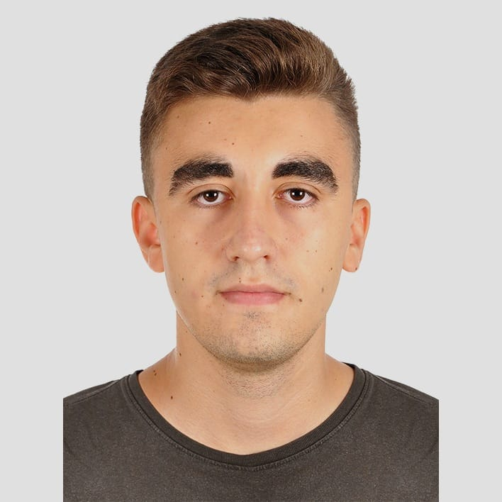
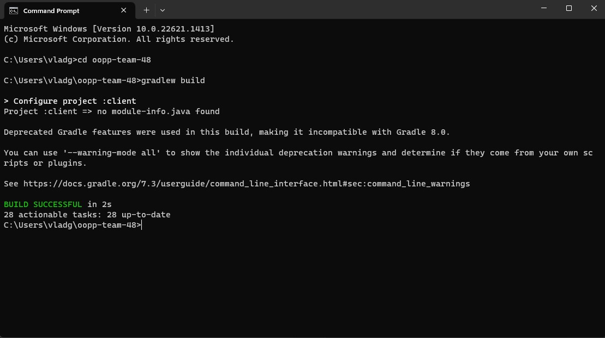
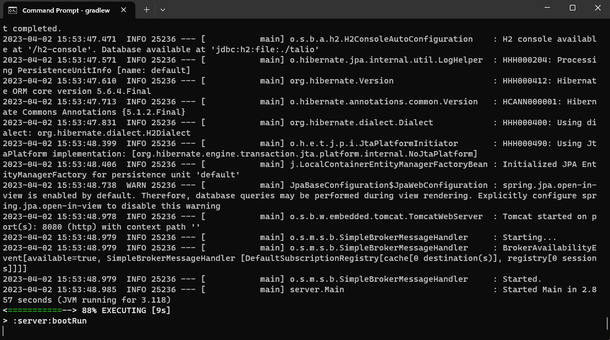

## Description of project
Talio is a web application designed to help users manage projects and tasks. Talio allows users to organize
tasks into boards, lists, and cards, making it easy to track progress. With Talio, users can easily
create new boards, and track progress or set the level of priority using customizable tags. Whether you're working on a personal project
or managing a team, Talio provides a powerful and intuitive way to organize your tasks and stay productive.
Additionally, Talio offers support for collaborative work, allowing more users to view and edit a board at the same time. This way, we make it easier
to track and manage group projects and help everyone be on track with his/her tasks.

## Group members

| Profile Picture                                                                                                                                           | Name           | Email                           |
|-----------------------------------------------------------------------------------------------------------------------------------------------------------|----------------|---------------------------------|
|                                                                                                                              | Andrei Petre   | a.petre-1@student.tudelft.nl    |
|  | Jochem Pouwels | j.j.pouwels@student.tudelft.nl  |
|                                                    | Olaf Herman    | o.h.s.herman@student.tudelft.nl |
|                                                    | Jesse Klijnsma | j.b.klijnsma@student.tudelft.nl |
|                                                    | Lovro Mlikotić | l.mlikotic@student.tudelft.nl   |
|                                                                                                              | Vlad Graure    | v.s.graure@student.tudelft.nl   |

## How to run it

The application consists of two different parts: a REST API which serves as the server and manages the connection with the database and
the client application which is built using JavaFX. In order to run the application,several steps are required to be performed.

#### Downloading the application
1. Download the project repository and save it in the desired directory. The project can be found [here](https://gitlab.ewi.tudelft.nl/cse1105/2022-2023/teams/oopp-team-48.git).
2. Open a terminal (for example cmd on Windows). This can be achieved by pressing <kbd>Windows</kbd> + <kbd>R</kbd>. In the menu that opens, type
cmd` and press <kbd>Enter</kbd>. This will open the Command Prompt.
3. Type `cd` followed by the absolute path in the command prompt. For example, `cd C:\Users\Username\Documents\oopp-group-48`. Then press <kbd>Enter</kbd>.
4. Run the following command `gradlew build`. This will build the project and install the needed dependencies. If the job succeeds, as it should, it will look something like this:

#### Running the server
1. After completing the downloading phase and making sure that the project has been built, the server can be run.
2. In the same terminal, type the following command: `gradlew bootRun`. This will wun the server. It should look like the following, if everything has
been done correctly so far:

3. Now the server is running. It is running by default on `http://localhost:8080/`.

#### Running the client application
1. Leave the terminal in which the server is running open.
2. Follow the same procedure as before: open a new terminal and navigate to the project directory using the `cd` command.
3. After reaching the directory, while having the server running (the application can be run without the server, but it will not have many features as most of them involve
communication with the server) run the following command: `gradlew run`.
4. Now, the client application has been opened, and the application can be used.

## How to contribute to it
We are very pleased that you are interested in contributing to improving Talio. 
This document provides guidance and instructions on how you can get involved and make a meaningful impact on our project and improve the experience of the users.

#### Why Contribute
Our project is open-source. We believe that by collaborating with other developers, we can create a better product that is more useful and effective for our users.
We welcome contributions from anyone who shares our vision and wants to make task organization and planning easier.

#### How to Contribute
There are many ways in which you can contribute to our project:

1. Report bugs and issues: If you encounter any issues while using our application, please let us know by opening a new issue on our GitLab repository. Please try to describe the
bug as good as possible, so we can identify it easier.
2. Suggest new features: If you have any ideas for new features that you think would be valuable, please open a new issue on our GitLab repository.
3. Submit code: If you are a developer and would like to contribute code to our project, fork our GitLab repository, create a new branch for your changes, and submit a merge request.

#### Code of Conduct
In the docs section, the Code of Conduct of our team can be found. We expect everyone that wants to contribute to our project to adhere to the conditions stipulated in this document.

#### Contact Us
If you have any questions or need help getting started with contributing, please feel free to reach out to us at the mail provided in the [Group Members section](#group-members). 
We look forward to working with you to make our application the best it can be!

## Copyright / License
The project is owned and maintained by the development team which cam be found [here](#group-members).

Users are permitted to use this application for personal purposes, subject to the following restrictions:

- The application may not be distributed or sold without our permission.
- The application may not be used for any illegal purposes.
- Our team is not responsible for any damages resulting from the use of this application.

If you have any questions about the use of this application or its associated materials, please contact us at one of our email addresses.